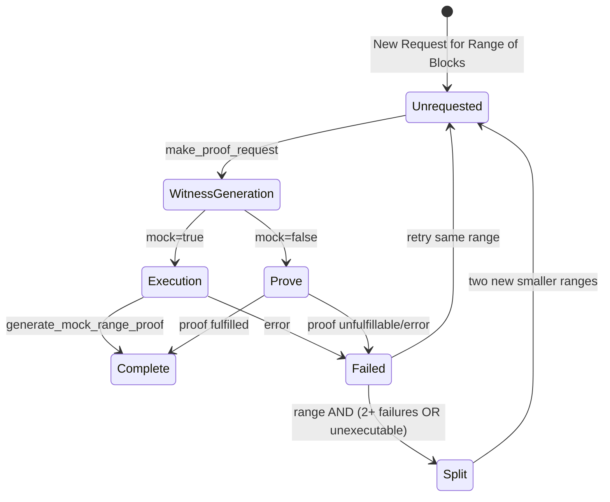
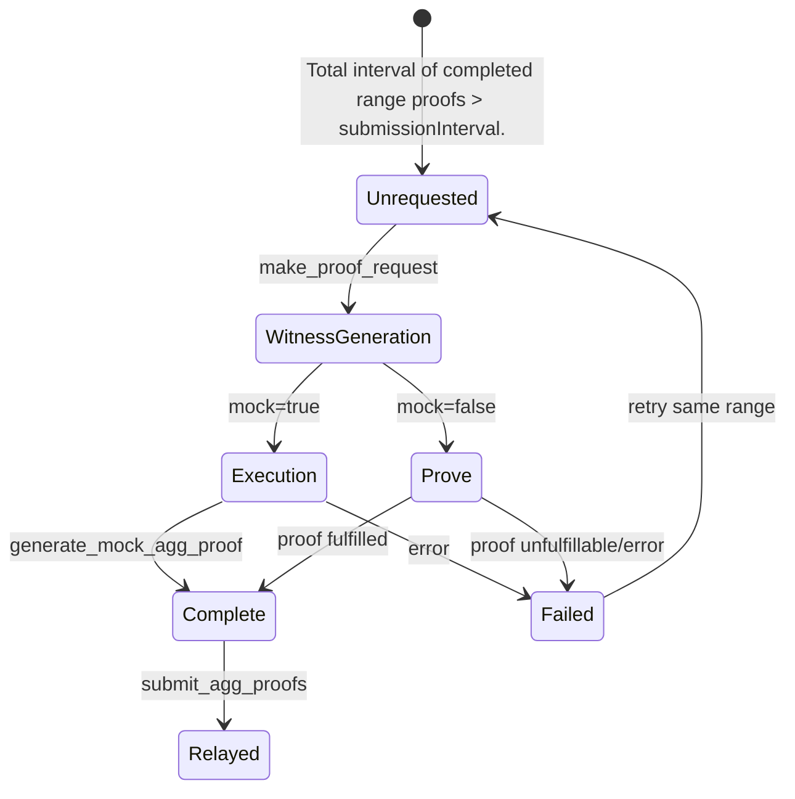

# Proposer

The `op-succinct` service consists of one service that monitors the state of the L2 chain, requests proofs and submits them to the L1. Proofs are submitted to the [Succinct Prover Network](https://docs.succinct.xyz/docs/sp1/generating-proofs/prover-network)

# Prerequisites

## RPC Requirements

Confirm that your RPC's have all of the required endpoints. More details can be found in the [prerequisites](../quick-start/prerequisites.md#requirements) section.

## Hardware Requirements

We recommend the following hardware configuration for the `op-succinct` validity service with 1 concurrent proof request & 1 concurrent witness generation thread (default):

Using the docker compose file:

- Full `op-succinct` service: 2 vCPUs, 8GB RAM.
- Mock `op-succinct` service: 2 vCPUs, 16GB RAM. Increased memory because the machine is executing the proofs locally.

For advanced configurations, depending on the number of concurrent requests you expect, you may need to increase the number of vCPUs and memory allocated to the `op-succinct` container.

# Environment Setup

Make sure to include *all* of the required environment variables in the `.env` file.

Before starting the proposer, ensure you have deployed the L2 Output Oracle and have the address of the proxy contract ready. Follow the steps in the [Contract Configuration](../contracts/configuration.md) section.

## Required Environment Variables

| Parameter | Description |
|-----------|-------------|
| `L1_RPC` | L1 Archive Node. |
| `L1_BEACON_RPC` | L1 Consensus (Beacon) Node. |
| `L2_RPC` | L2 Execution Node (`op-geth`). |
| `L2_NODE_RPC` | L2 Rollup Node (`op-node`). |
| `NETWORK_PRIVATE_KEY` | Key for the Succinct Prover Network. Get access [here](https://docs.succinct.xyz/docs/sp1/generating-proofs/prover-network). |
| `L2OO_ADDRESS` | Address of the `OPSuccinctL2OutputOracle` contract. |
| `PRIVATE_KEY` | Private key for the account that will be posting output roots to L1. |
| `DATABASE_URL` | The address of a Postgres database for storing the intermediate proposer state. |

## Advanced Environment Variables

| Parameter | Description |
|-----------|-------------|
| `NETWORK_RPC_URL` | Default: `https://rpc.production.succinct.xyz`. RPC URL for the Succinct Prover Network. |
| `RANGE_PROOF_STRATEGY` | Default: `reserved`. Set to `hosted` to use hosted proof strategy. |
| `AGG_PROOF_STRATEGY` | Default: `reserved`. Set to `hosted` to use hosted proof strategy. |
| `AGG_PROOF_MODE` | Default: `groth16`. Set to `plonk` to use PLONK proof type. Note: The verifier gateway contract address must be updated to use PLONK proofs. |
| `SUBMISSION_INTERVAL` | Default: `1800`. The number of L2 blocks that must be proven before a proof is submitted to the L1. Note: The interval used by the validity service is always >= to the `submissionInterval` configured on the L2OO contract. To allow for the validity service to configure this parameter entirely, set the `submissionInterval` in the contract to `1`. |
| `RANGE_PROOF_INTERVAL` | Default: `1800`. The number of blocks to include in each range proof. For chains with high throughput, you need to decrease this value. |
| `MAX_CONCURRENT_PROOF_REQUESTS` | Default: `1`. The maximum number of concurrent proof requests (in mock and real mode). |
| `MAX_CONCURRENT_WITNESS_GEN` | Default: `1`. The maximum number of concurrent witness generation requests. |
| `OP_SUCCINCT_MOCK` | Default: `false`. Set to `true` to run in mock proof mode. The `OPSuccinctL2OutputOracle` contract must be configured to use an `SP1MockVerifier`. |
| `METRICS_PORT` | Default: `8080`. The port to run the metrics server on. |
| `LOOP_INTERVAL` | Default: `60`. The interval (in seconds) between each iteration of the OP Succinct service. |
| `DGF_ADDRESS` | Address of the `DisputeGameFactory` contract. Note: If set, the proposer will create a validity dispute game that will resolve with the proof. Compatible with `OptimismPortal2`. |
| `PROVER_ADDRESS` | Address of the account that will be posting output roots to L1. This address is committed to when generating the aggregation proof to prevent front-running attacks. It can be different from the signing address if you want to separate these roles. Default: The address derived from the `PRIVATE_KEY` environment variable. |
| `SIGNER_URL` | URL for the Web3Signer. Note: This takes precedence over the `PRIVATE_KEY` environment variable. |
| `SIGNER_ADDRESS` | Address of the account that will be posting output roots to L1. Note: Only set this if the signer is a Web3Signer. Note: Required if `SIGNER_URL` is set. |
| `SAFE_DB_FALLBACK` | Default: `false`. Whether to fallback to timestamp-based L1 head estimation even though SafeDB is not activated for op-node.  When `false`, proposer will panic if SafeDB is not available. It is by default `false` since using the fallback mechanism will result in higher proving cost. |

# Build the Proposer Service

Build the OP Succinct validity service.

```bash
docker compose build
```

# Run the Proposer

Run the OP Succinct validity service.

```bash
docker compose up
```

To see the logs of the OP Succinct services, run:

```bash
docker compose logs -f
```

After a few minutes, you should see the validity service start to generate range proofs. Once enough range proofs have been generated, they will be verified in an aggregation proof and submitted to the L1.

To stop the OP Succinct validity service, run:

```bash
docker compose stop
```

## Lifecycle

The following diagrams show the lifecycle of range and aggregation proofs.

### Range Proof Lifecycle



### Aggregation Proof Lifecycle



### Operations
The proposer performs the following operations each loop:

1. Validates that the requester config matches the contract configuration
2. Logs proposer metrics like number of requests in each state
3. Handles ongoing tasks by checking completed/failed tasks and cleaning them up
4. Sets orphaned tasks (in WitnessGeneration/Execution but not in tasks map) to Failed status
5. Gets proof statuses for all requests in proving state from the Prover Network
6. Adds new range requests to cover gaps between latest proposed and finalized blocks. If a request failed, this is where the request is re-tried.
7. Creates aggregation proofs from completed contiguous range proofs.
8. Requests proofs for any unrequested proofs from the prover network/generates mock proofs.
9. Submits any completed aggregation proofs to the L2 output oracle contract.

The loop runs continuously with a configurable interval (default 60 seconds) between iterations.
