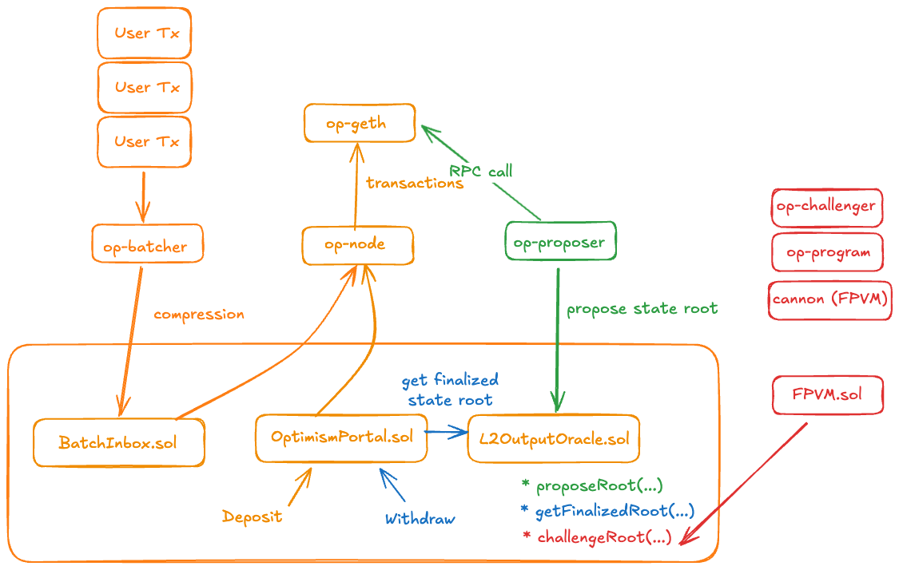
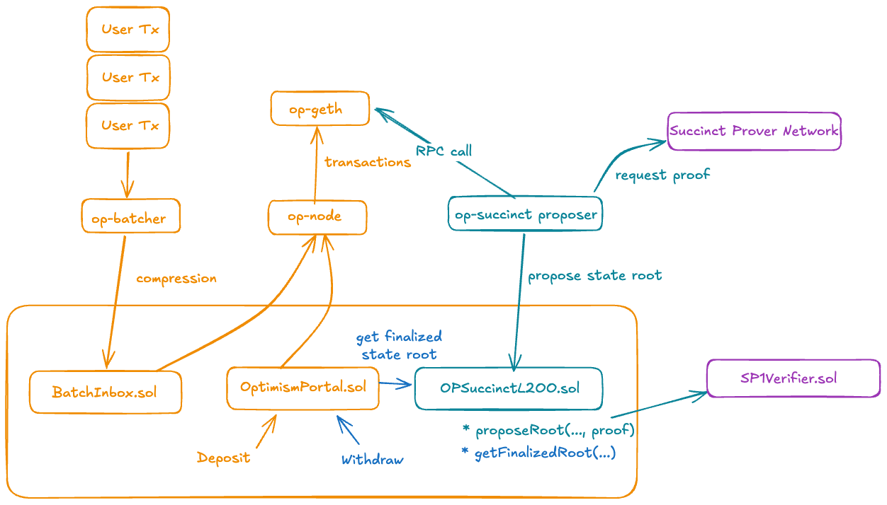

# Architecture

## System Overview

OP Succinct is a lightweight upgrade to the OP Stack that enables ZK-based finality.

This document explains the standard OP Stack components and the lightweight modifications OP Succinct adds to enable proving blocks with zero-knowledge proofs using [SP1](https://docs.succinct.xyz/docs/sp1/introduction).

## Standard OP Stack Design

In the specification of the [standard OP Stack design](https://specs.optimism.io/), there are 4 main components.

1. OP Geth: Execution engine for the L2.
2. OP Batcher: Collects and batches users transactions efficiently and posts to L1.
3. OP Node: Reads batch data from L1, and passes to OP Geth to perform state transitions.
4. OP Proposer: Posts state roots from OP Node to L1. Enables withdrawal processing.

## OP Succinct Design

### Overview

OP Succinct is a lightweight upgrade to the OP Stack that enables ZK-based finality. Specifically, it upgrades a single on-chain contract and the `op-proposer` component. No changes are needed to `op-geth`, `op-batcher`, or `op-node`.

### Service Architecture

The OP Succinct Proposer is a new service that orchestrates the proving pipeline. It monitors L1 for posted batches, generates proofs, and submits them to L1 with ZK proofs.

1. User transactions are processed by standard OP Stack components.
2. Validity proofs are generated for ranges of blocks with the range program.
3. Combine range proofs into a single aggregationproof that is cheaply verifiable on-chain.
4. OP Succinct proposer submits aggregation proof to the on-chain contract.
5. The on-chain contract verifies the proof and updates the L2 state root for withdrawals.

