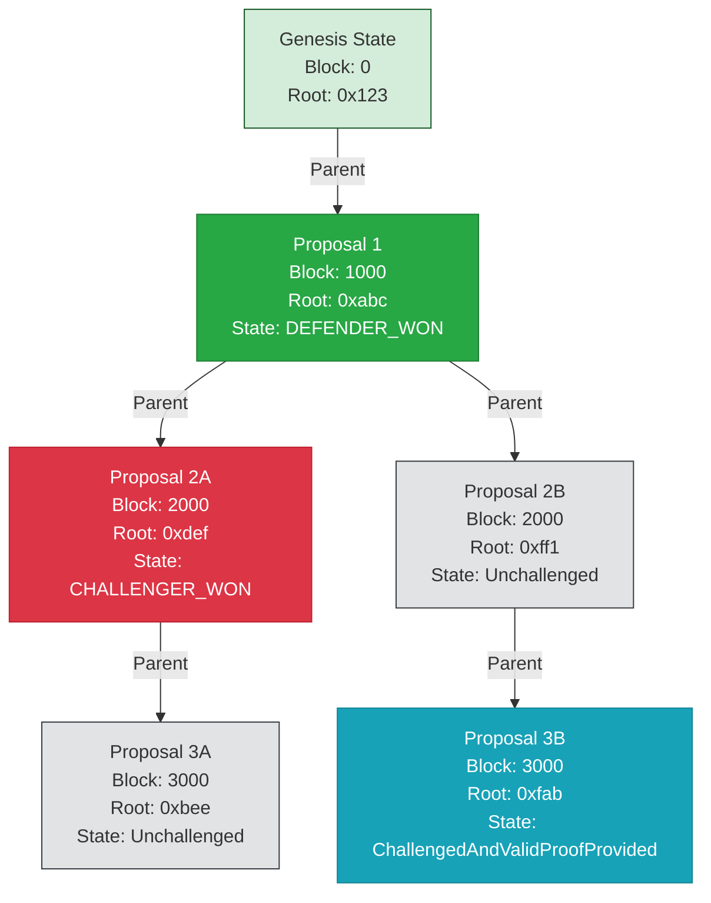

# Architecture

OP Succinct is also offered in "fault proof" mode, which is a good solution for chains that wish to have faster finality while not paying the ZK proving costs for every single block. The exact same OP Succinct ZK program is used for this mode--the only difference is the smart contrcts deployed onchain that integrate with OP Stack's `DisputeGameFactory` contract.

## Overview

We assume that the reader has a solid understanding of the OP Stack's `DisputeGameFactory` and `IDisputeGame` interface. Documentation can be found [here](https://specs.optimism.io/fault-proof/stage-one/dispute-game-interface.html). We implement the `IDisputeGame` interface with a ZK-enabled fault proof (using the OP Succinct SP1 program) instead of the standard interactive bisection game that the vanilla OP Stack uses.

## Core Concepts

1. **Proposals**: Each proposal represents a claimed state transition from a start L2 block to an end L2 block with a `startL2OutputRoot` and a `claimedL2OutputRoot` where the output root is a commitment to the entirety of L2 state.
2. **Challenges**: Participants can challenge proposals they believe are invalid.
3. **Proofs**: ZK proofs that verify the correctness of state transitions contained in proposals, anchored against an L1 block hash.
4. **Resolution**: Process of determining whether a proposal is valid or not.

## Dispute Game Implementation

Proposing new state roots goes through the regular flow of the `DisputeGameFactory` to the `OPSuccinctFaultDisputeGame` contract that implements the `IDisputeGame` interface. Each proposal contains a link to a previous parent proposal (unless it is the first proposal after initialization, in which case it stores the previous parent as `addr(0)`), and includes a `l2BlockNumber` and claimed `l2OutputRoot`.

Once a proposal is published and a `OPSuccinctFaultDisputeGame` created, the dispute game can be in one of several states:

- **Unchallenged**: The initial state of a new proposal
- **Challenged**: A proposal that has been challenged but not yet proven
- **ChallengedAndValidProofProvided**: A challenged proposal that has been proven valid with a verified proof
- **Resolved**: The final state after resolution, either `GameStatus.CHALLENGER_WINS` or `GameStatus.DEFENDER_WINS`.

Note that "challenging" a proposal does not require a proof--as we want challenges to be able to be submitted quickly, without waiting for proof generation delay. Once a challenge is submitted, then the proposal's "timeout" is extended by a `provingTime` parameter that allows for an extended amount of time to generate a proof to prove that the original proposal is correct. If a proof of validity is not submitted by the deadline, then the proposal is assumed to be invalid and the challenger wins. If a valid proof is submitted by the deadline, then the original proposer wins the dispute. Note that if a parent game is resolved in favor of a challenger wining, then any child game will also be considered invalid.

**Illustrative Example**



In this example, Proposal 3A would always resolve to `CHALLENGER_WON`, as its parent 2A has `CHALLENGER_WON`. Proposal 3B would resolve to `DEFENDER_WON` if and only if its parent 2B successfully is unchallenged past its deadline and the final status is `DEFENDER_WON`.

## Contract Description

### Immutable Parameters

- `challengeTime`: Time window during which a proposal can be challenged
- `provingTime`: Time allowed for proving a challenge
- `aggregationVkey`: ZK Verification key for the aggregation SP1 program that aggregates several range proofs into a contiguous block.
- `rangeVkeyCommitment`: ZK Verification key for the "range" SP1 program that proves a range of L2 blocks.
- `rollupConfigHash`: Hash of the chain's rollup configuration
- `firstBlockNumber`: First block number
- `firstOutputRoot`: First output root corresponding to first block number
- `proofReward`: Amount of ETH required to submit a challenge (the reward given to a proof generator).
- `proposalBond`: Amount of ETH required to submit a proposal

### Key Functions

### Initialization

```solidity
function initialize() external payable
```

Initializes the dispute game with:

- Parent game reference (if any)
- Claimed output root
- Proposer's bond deposit, as enforced by the `DisputeGameFactory` contract

### Challenge

```solidity
function challenge() public payable
```

Allows participants to challenge a proposal by:

- Depositing the challenge bond (the proof reward)
- Setting the proposal deadline to be `+ provingTime` over the current timestamp
- Updating proposal state to `Challenged`

### Proving

```solidity
function prove(uint256 _l1BlockNumber, bytes memory proof) public
```

Validates a proof for a challenged proposal:

- Verifies L1 block hash exists against the block hash cache
- Validates proof against the proposal's start output root and claimed l2 block number + output root, and other rollup parameters (like config hash and relevant vkeys)
- Updates proposal state to `ChallengedAndValidProofProvided`
- Distributes reward to the prover

### Resolution

```solidity
function resolve() external returns (GameStatus status_)
```

Resolves the game by:

- Checking parent game status. Ensures that the parent game is resolved and that the proposal is valid. If the proposal is invalid (aka `CHALLENGER_WON`), then set the current game status to `CHALLENGER_WON`.
- If the current game is in `ChallengedAndValidProofProvided` state, then set `DEFENDER_WON`
- Ensure that the deadline has passed, and if the proposal is `Unchallenged`, then set `DEFENDER_WON`.
- Ensure that the deadline has passed, and if the proposal is `Challenged`, then set `CHALLENGER_WON`
- Distributing bonds based on outcome

## Security Model

### Bond System

The contract implements a bond system to incentivize honest behavior:

1. **Proposal Bond**: Required to submit a proposal
2. **Challenge Bond**: Required to challenge a proposal
3. **Proof Reward**: Paid to successful provers

### Time Windows

Two key time windows ensure fair participation:

1. **Challenge Window**: Period during which proposals can be challenged
2. **Proving Window**: Time allowed for submitting proofs after a challenge

### Parent-Child Relationship

Proposals maintain a hierarchical relationship:

- Each proposal (except the first) has a parent
- Child proposals are only valid if their parent is valid
- Invalid parents automatically invalidate children

## Acknowledgements

Zach Obront, who worked on the first version of OP Succinct, prototyped a similar `MultiProof` dispute game implementation with OP Succinct as part of his work with the Ithaca team. This fault proof implementation takes some inspiration from his multiproof work.
