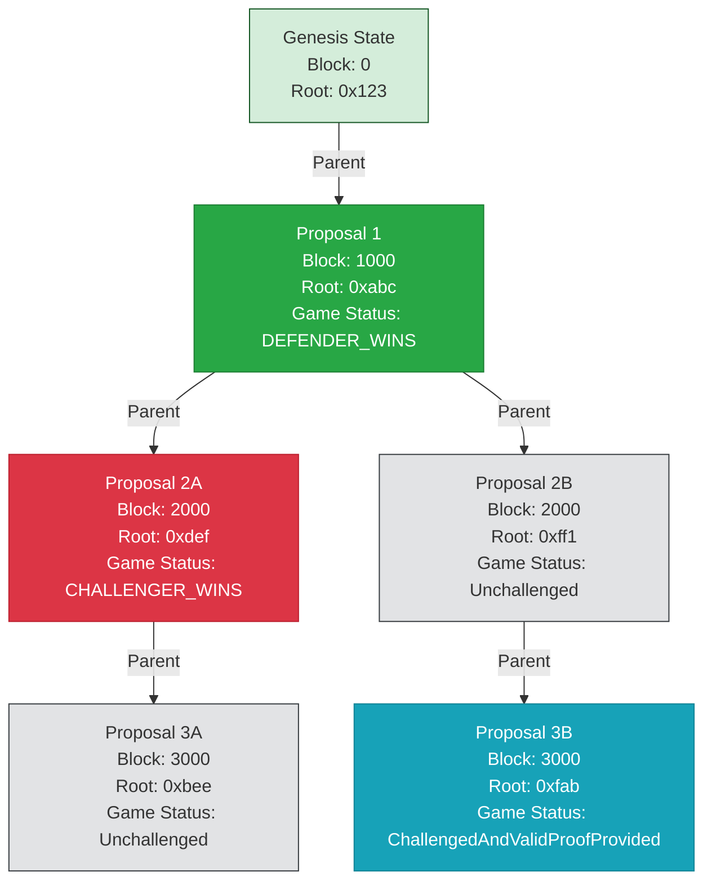

# Architecture

## Overview

OP Succinct's fault proof mode offers faster finality without ZK proving costs for every block. This mode uses:
- The same OP Succinct ZK program
- `OPSuccinctFaultDisputeGame` contract integrated with OP Stack's [DisputeGameFactory](https://github.com/ethereum-optimism/optimism/blob/v1.11.1/packages/contracts-bedrock/src/dispute/DisputeGameFactory.sol)
- Single-round dispute resolution with ZK proofs

We assume that the reader has a solid understanding of the OP Stack's `DisputeGameFactory` and `IDisputeGame` interface. Documentation can be found [here](https://specs.optimism.io/fault-proof/stage-one/dispute-game-interface.html). We implement the `IDisputeGame` interface with a ZK-enabled fault proof (using the OP Succinct ZK program) instead of the standard interactive bisection game that the vanilla OP Stack uses.

## Core Concepts

1. **Proposals**: Each proposal represents a claimed state transition from a start L2 block to an end L2 block with a `startL2OutputRoot` and a `claimedL2OutputRoot` where the output root is a commitment to the entirety of L2 state.
2. **Challenges**: Participants can challenge proposals they believe are invalid.
3. **Proofs**: ZK proofs that verify the correctness of state transitions contained in proposals, anchored against an L1 block hash.
4. **Resolution**: Process of determining whether a proposal is valid or not.

## Dispute Game Implementation

Proposing new state roots goes through the regular flow of the `DisputeGameFactory` to the `OPSuccinctFaultDisputeGame` contract that implements the `IDisputeGame` interface. Each proposal contains a link to a previous parent proposal (unless it is the first proposal after initialization, in which case it stores the parent index as `uint32.max`), and includes a `l2BlockNumber` and claimed `l2OutputRoot`.

Once a proposal is published and a `OPSuccinctFaultDisputeGame` created, the dispute game can be in one of several states:

- **Unchallenged**: The initial state of a new proposal.
- **Challenged**: A proposal that has been challenged but not yet proven.
- **UnchallengedAndValidProofProvided**: A proposal that has been proven valid with a verified proof.
- **ChallengedAndValidProofProvided**: A challenged proposal that has been proven valid with a verified proof.
- **Resolved**: The final state after resolution, either `GameStatus.CHALLENGER_WINS` or `GameStatus.DEFENDER_WINS`.

Note that "challenging" a proposal does not require a proof--as we want challenges to be able to be submitted quickly, without waiting for proof generation delay. Once a challenge is submitted, then the proposal's "timeout" is set to `MAX_PROVE_DURATION` parameter that allows for an extended amount of time to generate a proof to prove that the original proposal is correct. If a proof of validity is not submitted by the deadline, then the proposal is assumed to be invalid and the challenger wins. If a valid proof is submitted by the deadline, then the original proposer wins the dispute. Note that if a parent game is resolved in favor of a challenger wining, then any child game will also be considered invalid.

**Illustrative Example**



In this example, Proposal 3A would always resolve to `CHALLENGER_WINS`, as its parent 2A has `CHALLENGER_WINS`. Proposal 3B would resolve to `DEFENDER_WINS` if and only if its parent 2B successfully is unchallenged past its deadline and the final status is `DEFENDER_WINS`.

## Contract Description

### Immutable Variables

- `MAX_CHALLENGE_DURATION`: Time window during which a proposal can be challenged.
- `MAX_PROVE_DURATION`: Time allowed for proving a challenge.
- `GAME_TYPE`: The type of the game, which is set in the `DisputeGameFactory` contract.
- `DISPUTE_GAME_FACTORY`: The factory contract that creates this game.
- `SP1_VERIFIER`: The verifier contract that verifies the SP1 proof.
- `ROLLUP_CONFIG_HASH`: Hash of the chain's rollup configuration
- `AGGREGATION_VKEY`: The verification key for the aggregation SP1 program.
- `RANGE_VKEY_COMMITMENT`: The commitment to the BabyBear representation of the verification key of the range SP1 program.
- `CHALLENGER_BOND`: Amount of ETH required to submit a challenge (given to prover if they provide a valid proof).
- `ANCHOR_STATE_REGISTRY`: The anchor state registry contract.
- `ACCESS_MANAGER`: The access manager contract.

### Types

#### ProposalStatus

While `GameStatus` (IN_PROGRESS, DEFENDER_WINS, CHALLENGER_WINS) represents the final outcome of the game, we need `ProposalStatus` to:
1. allow proving for fast finality even if the proposal is unchallenged.
2. allow anyone to prove a proposal even the prover is not the proposer.

Represents the current state of a proposal in the dispute game:

```solidity
enum ProposalStatus {
    Unchallenged,                        // Initial state: New proposal without challenge
    Challenged,                          // Challenged by someone, awaiting proof
    UnchallengedAndValidProofProvided,   // Valid proof provided without any challenge
    ChallengedAndValidProofProvided,     // Valid proof provided after being challenged
    Resolved                             // Final state after game resolution
}
```

Proposal Status Transitions:
- `Unchallenged` → 
  - `Challenged` (via `challenge()`)
  - `UnchallengedAndValidProofProvided` (via `prove()`)
  - `Resolved` (via `resolve()`)
- `Challenged` → 
  - `ChallengedAndValidProofProvided` (via `prove()`)
  - `Resolved` (via `resolve()`)
- `UnchallengedAndValidProofProvided` → `Resolved` (via `resolve()`)
- `ChallengedAndValidProofProvided` → `Resolved` (via `resolve()`)

#### ClaimData

Core data structure holding the state of a proposal:

```solidity
struct ClaimData {
    uint32 parentIndex;        // Reference to parent game (uint32.max for first game)
    address counteredBy;       // Address of challenger (address(0) if unchallenged)
    address prover;            // Address that provided valid proof (address(0) if unproven)
    Claim claim;               // The claimed L2 output root
    ProposalStatus status;     // Current status of the proposal
    Timestamp deadline;        // Time by which proof must be provided
}
```

Key differences from Optimism's implementation:
- `parentIndex` is initialized on `initialize()`.
- Simplified to single claim instead of array of claims.
- Removed `claimant` and `position` fields since there is no bisection.
- Removed `bond` field since bonds are stored in the game contract.
- Added `prover` field to enable anyone to prove a proposal even the prover is not the proposer.
- Added proposal status.
- Uses deadline instead of clock with period getters.

### Key Functions

### Initialization

```solidity
function initialize() external payable virtual
```

Initializes the dispute game with:

- Initial state of the game
  - `startingOutputRoot`: Starting point for verification
    - For first game: Anchor state root for the game type
    - For subsequent games: Parent game's root claim and block number
  
  - `claimData`: Core game state
    - `parentIndex`: Reference to the parent game (`uint32.max` for first game)
    - `counteredBy`: Initially `address(0)`
    - `prover`: Initially `address(0)`
    - `claim`: Proposer's claimed output root
    - `status`: Set to `ProposalStatus.Unchallenged`
    - `deadline`: Set to `block.timestamp + MAX_CHALLENGE_DURATION`

- Validation Rules
  - Parent Game (if not first game)
    - Must not have been blacklisted
    - Must have been respected game type when created
    - Must not have been won by challenger
  
  - Output Root
    - Must be after starting block number
    - First game starts from the anchor state root for the game type
    - Later games start from parent's output root

- Bond Management
  - Proposer's bond enforced by factory
  - Held in contract until resolution

Initialization will revert if:
- Already initialized
- Invalid parent game
- Root claim at/before starting block
- Incorrect calldata size for `extraData`
- Proposer is not whitelisted

### Challenge

```solidity
function challenge() external payable returns (ProposalStatus)
```

Allows participants to challenge a proposal by:

- Depositing the challenger bond (the proof reward)
- Setting the proposal deadline to be `+ provingTime` over the current timestamp
- Updating proposal state to `ProposalStatus.Challenged`

Attempting to challenge a game will revert if:
- Game is over (past deadline or already proven)
- Challenger is not whitelisted
- Incorrect bond amount provided

### Proving

```solidity
function prove(bytes calldata proofBytes) external returns (ProposalStatus)
```

Validates a proposal with a proof:

- Timing Requirements
  - Must be submitted before the game is over (deadline passed or already proven)

- Proof Verification
  - Uses SP1 verifier to validate the aggregation proof against public inputs:
    - L1 head hash (from game creation)
    - Starting output root (from parent game or anchor state root)
    - Claimed output root
    - Claimed L2 block number
    - Rollup configuration hash
    - Range verification key commitment
  - Uses aggregation verification key to verify the proof

- State Updates
  - Records the prover's address in `claimData.prover`
  - Updates proposal status if the proof is valid:
    - `ProposalStatus.UnchallengedAndValidProofProvided` if there was no challenge
    - `ProposalStatus.ChallengedAndValidProofProvided` if there was a challenge

- Rewards
  - No immediate reward distribution
  - Proof reward is distributed in `claimCredit()`:
    - If challenged: prover receives the challenger's bond
    - If unchallenged: no reward but can have fast finality

Attempting to submit a proof will revert if:
- Proof is not submitted before the proof deadline
- Proof is not valid
- If a prover tries to prove a game that has already been proven

### Resolution

```solidity
function resolve() external returns (GameStatus)
```

Resolves the game by:

- Checking parent game status:
  - Must be resolved
  - Must be respected
  - Must not be blacklisted
  - Must not be retired
  - If parent game is `CHALLENGER_WINS`, current game automatically resolves to `CHALLENGER_WINS`

- For other cases:
  - Game must be over (past deadline or proven)
  - Resolution depends on final state:
    - Unchallenged: `DEFENDER_WINS`, proposer gets its bond back
    - Challenged: `CHALLENGER_WINS`, challenger gets everything
    - UnchallengedAndValidProofProvided: `DEFENDER_WINS`, proposer gets its bond back
    - ChallengedAndValidProofProvided: `DEFENDER_WINS`, prover gets challenger bond, proposer gets its bond back

Attempting to resolve will revert if:
- Parent game is not yet resolved
- Game is already resolved (i.e, not `IN_PROGRESS`)
- Challenge/proof window has not expired

### Reward Distribution

```solidity
function claimCredit(address _recipient) external
```

Claims rewards by:

- Closing the game and determining bond distribution mode if not already set
- Checking recipient's credit balance based on distribution mode:
  - `NORMAL`: Uses `normalModeCredit` for standard game outcomes
  - `REFUND`: Uses `refundModeCredit` when game is improper
- Setting recipient's credit balance to 0
- Transferring ETH to recipient

Attempting to claim will revert if:
- Game is not resolved
- Game is not finalized according to AnchorStateRegistry
- Recipient has no credit to claim
- ETH transfer fails
- Invalid bond distribution mode

Bond distribution modes:
- `NORMAL`: Standard outcome-based distribution
  - Defender wins unchallenged: Proposer gets full bond
  - Defender wins challenged: Prover gets reward, proposer gets remainder
  - Challenger wins: Challenger gets full bond
- `REFUND`: Returns bonds to original depositors when game is improper

## Security Model

### Bond System

The contract implements a bond system to incentivize honest behavior:

1. **Proposal Bond**: Required to submit a proposal.
2. **Challenger Bond (Proof Reward)**: Required to challenge a proposal, which is paid to successful provers.

### Time Windows

Two key time windows ensure fair participation:

1. **Challenge Window**: Period during which proposals can be challenged.
2. **Proving Window**: Time allowed for submitting proofs after a challenge.

### Parent-Child Relationships

- Each game (except genesis) has a parent
- Invalid parent automatically invalidates children
- Child games can only be resolved if their parent game is resolved

## Acknowledgements

Zach Obront, who worked on the first version of OP Succinct, prototyped a similar `MultiProof` dispute game implementation with OP Succinct as part of his work with the Ithaca team. This fault proof implementation takes some inspiration from his multiproof work.
