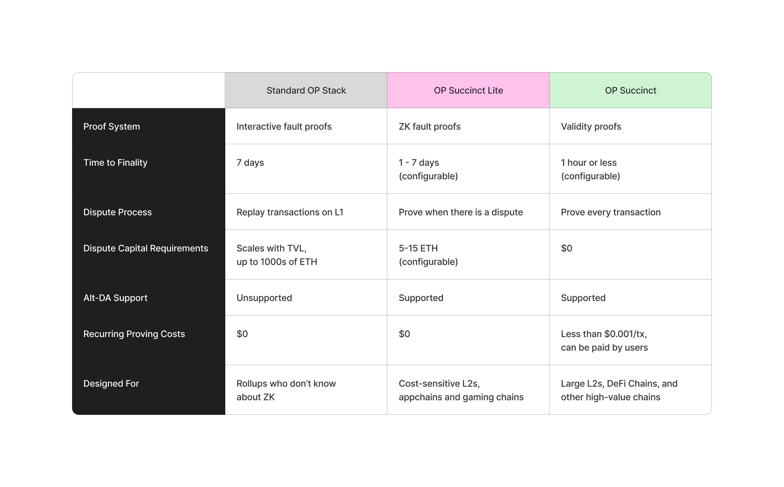

# OP Succinct

   
   

## Overview

OP Succinct gives **every** OP Stack rollup the ability to become a ZK rollup.

It combines a few key technologies:
- [Kona](https://op-rs.github.io/kona/), Optimism's Rust implementation of the OP Stack's state transition function
- [SP1](https://docs.succinct.xyz/docs/sp1/introduction), Succinct's state-of-the-art Rust zkVM.
- [Succinct Prover Network](https://docs.succinct.xyz/docs/network/introduction), Succinct's low-latency, cost-effective proving API

OP Succinct is the only production-ready proving solution for the OP Stack and trusted by teams like [Mantle](https://www.mantle.xyz/blog/announcements/op-succinct-mantle-network-testnet) and [Phala](https://phala.network/posts/phala-network-20-first-opsuccinct-layer-2-on-ethereum).

## Proving Options

Rollups can choose between two configurations:
- ZK fault proofs (OP Succinct Lite) — only generate a zero-knowledge proof when there is a dispute
- Validity proofs (OP Succinct) — generate a zero-knowledge proof for every transaction, eliminating disputes entirely

Both configurations offer meaningful advantages over the standard OP Stack design.

## Support and Community

All of this has been possible thanks to close collaboration with the core team at [OP Labs](https://www.oplabs.co/).

**Ready to upgrade your rollup with ZK? [Contact us](https://docs.google.com/forms/d/e/1FAIpQLSd2Yil8TrU54cIuohH1WvDvbxTusyqh5rsDmMAtGC85-Arshg/viewform?ref=https://succinctlabs.github.io/op-succinct/) to get started with OP Succinct.**
