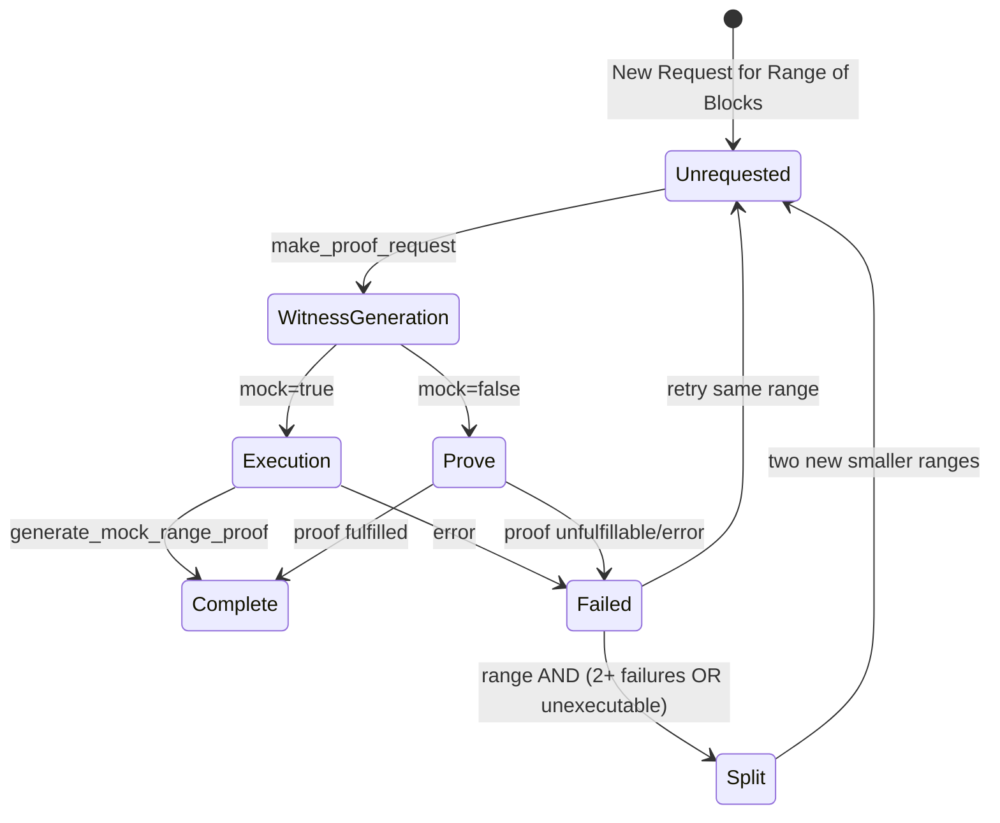
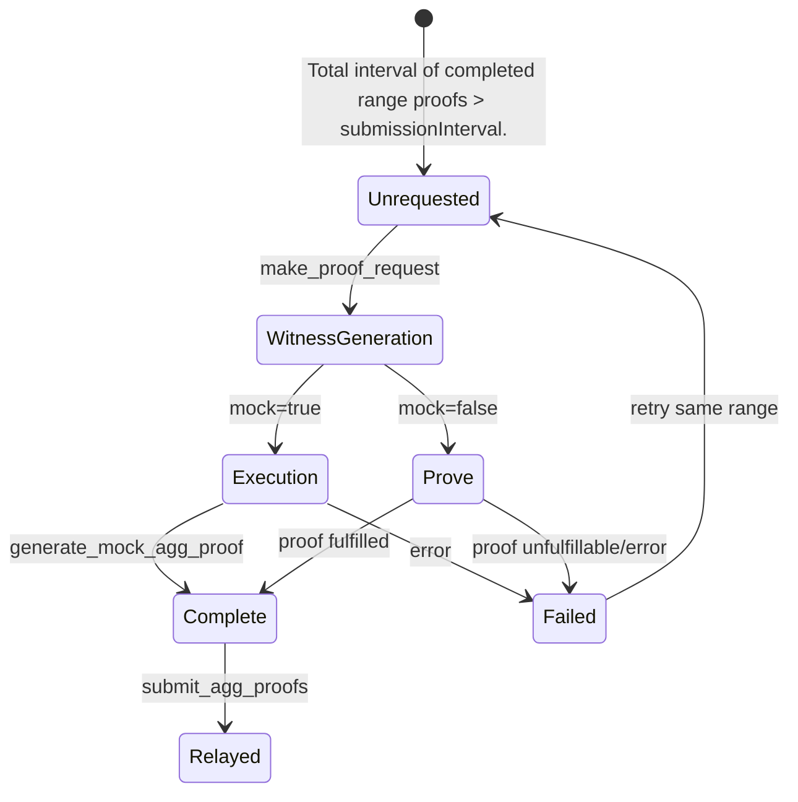

# Proposer Lifecycle

The proposer service monitors the state of the L2 chain, requests proofs and submits them to the L1. Proofs are submitted to the [Succinct Prover Network](https://docs.succinct.xyz/docs/sp1/generating-proofs/prover-network). Here's how the proposer service decides when to request range and aggregation proofs.

## Range Proof Lifecycle

## Aggregation Proof Lifecycle

## Proposer Operations

The proposer performs the following operations each loop (every 30 seconds by default):

1. Validates that the requester config matches the contract configuration
2. Logs proposer metrics like number of requests in each state
3. Handles ongoing tasks by checking completed/failed tasks and cleaning them up
4. Sets orphaned tasks (in WitnessGeneration/Execution but not in tasks map) to Failed status
5. Gets proof statuses for all requests in proving state from the Prover Network
6. Adds new range requests to cover gaps between latest proposed and finalized blocks. If a request failed, this is where the request is re-tried.
7. Creates aggregation proofs from completed contiguous range proofs.
8. Requests proofs for any unrequested proofs from the prover network/generates mock proofs.
9. Submits any completed aggregation proofs to the L2 output oracle contract.
