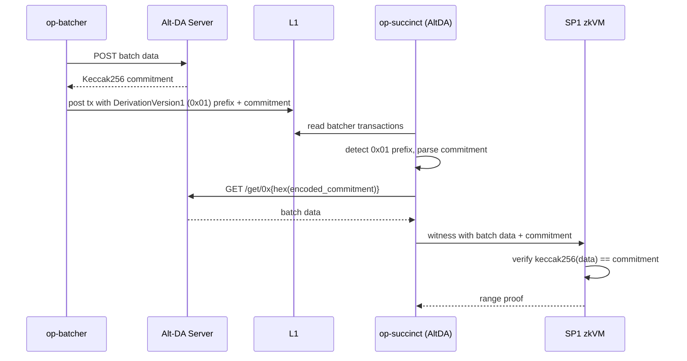

# AltDA (Validium)

<div class="warning">

This feature is experimental. Configuration keys, feature flags, and on-disk artifacts may change without notice.

</div>

## Overview

OP Succinct's AltDA mode supports OP Stack chains that publish batch data off-chain and post only commitments to L1 — the architecture commonly called a **validium**. The codebase uses "AltDA" throughout, matching the OP Stack alt-DA pathway it builds on; the rest of this page uses that term.

In AltDA mode, chain-layer responsibilities (derivation, validity proving, on-chain settlement) are handled by op-succinct. The data availability layer — the alt-DA server that stores batch data and serves it by commitment — is operated separately and is out of scope for this repository.

## Architecture



The OP Succinct proposer reads L1 calldata as usual. When a batcher transaction is prefixed with the `DerivationVersion1` byte (`0x01`), the AltDA data source parses the commitment and emits an `altda-commitment` hint to the host. The host fetches the corresponding batch data from the configured alt-DA server. The resolved data is loaded into the preimage oracle, where the SP1 zkVM verifies that `keccak256(data) == commitment` before accepting it into derivation.

### Out of scope

- The alt-DA server itself (storage, replication, availability guarantees).
- Generic-commitment-type encoding.
- On-chain DA challenge / bonding logic.

## Supported Commitment Types

| Type | Byte | Status |
|------|------|--------|
| Keccak256 | `0x00` | Supported. Integrity is enforced inside the zkVM via the preimage oracle (`keccak256(data) == commitment`). |
| Generic | `0x01` | Not supported in this release. The host rejects this commitment type. |

## Enabling AltDA Mode

AltDA mode is gated by the `altda` Cargo feature on the `validity` binary.

```bash
# From the repository root
cargo build --bin validity --release --features altda
```

## Environment Setup

Create a `.env` file with all base configuration variables from the [Proposer](../proposer.md) section, plus the AltDA-specific variable below.

### Required Variables

| Parameter | Description |
|-----------|-------------|
| `ALTDA_SERVER_URL` | Base URL of the alt-DA server (e.g., `http://localhost:8080`). The host fetches batch data via `GET {ALTDA_SERVER_URL}/get/0x{hex(encoded_commitment)}`. No default; required when running with the `altda` feature. |

The alt-DA server must implement the OP Stack alt-DA `GET` endpoint shape. Operators are responsible for running this server and consulting their DA provider's documentation for setup.

## AltDA Contract Configuration

Before deploying or updating contracts, generate the AltDA-specific range verification key, aggregation verification key, and rollup config hash with the correct feature flag. This ensures the range verification key commitment matches the AltDA range ELF:

```bash
# From the repository root
cargo run --bin config --release --features altda -- --env-file .env
```

The command prints the `Range Verification Key Hash`, `Aggregation Verification Key Hash`, and `Rollup Config Hash`; keep these values and ensure they match what you publish on-chain in `OPSuccinctL2OutputOracle`.

When you use the `just` helpers below, pass the `altda` feature so `fetch-l2oo-config` runs with the correct ELFs. If you call the binaries manually (`fetch-l2oo-config`, `config`, etc.), append `--features altda`; otherwise the script emits the default Ethereum DA values and your contracts will revert with `ProofInvalid()` when submitting proofs.

## Deploying `OPSuccinctL2OutputOracle` with AltDA features

```bash
just deploy-oracle .env altda
```

## Updating `OPSuccinctL2OutputOracle` Parameters

```bash
just update-parameters .env altda
```

For more details on the `just update-parameters` command, see the [Updating `OPSuccinctL2OutputOracle` Parameters](../contracts/update-parameters.md) section.

## Run the AltDA Proposer Service

Run the `op-succinct-altda` service.

```bash
docker compose -f docker-compose-altda.yml up -d
```

To see the logs of the `op-succinct-altda` service, run:

```bash
docker compose -f docker-compose-altda.yml logs -f
```

To stop the `op-succinct-altda` service, run:

```bash
docker compose -f docker-compose-altda.yml down
```

## Building the AltDA Range ELF

The AltDA range ELF (`altda-range-elf-embedded`) is embedded into the proposer binary at build time. To rebuild it from source, run:

```bash
just build-range-elfs
```

This recipe rebuilds all DA-variant range ELFs (Ethereum, Celestia, EigenDA, AltDA).

## Limitations

- **Experimental.** The AltDA feature is under active development. Configuration keys, feature flags, and on-disk artifacts may change without notice.
- **Keccak256 commitments only.** Generic commitments (`0x01`) are not supported in this release.
- **DA server availability assumption.** Proving stalls if the alt-DA server returns no data for a referenced commitment. The proposer cannot make progress past an unresolvable commitment.
- **DA server is outside the op-succinct trust boundary.** Data availability and censorship resistance depend on the alt-DA server operator. op-succinct verifies that retrieved data matches its commitment but cannot force the server to serve data.
- **Hardcoded HTTP timeout.** Requests to the alt-DA server use a 30s timeout that is not currently configurable.
- **Standard L1 head logic.** AltDA uses the same L1 head selection as Ethereum DA. There is no Blobstream-style finality tracking.

## OP Succinct Lite

AltDA support also exists for OP Succinct Lite (fault-proof) mode behind the same `altda` Cargo feature flag. Full Lite-mode AltDA documentation will follow. See the [OP Succinct Lite (Fault Proofs)](../../fault_proofs/intro.md) section for the base setup.

## Where to Go Next

- [Architecture](../../architecture.md)
- [Proposer Configuration](../proposer.md)
- [OP Stack alt-DA reference (`op-alt-da`)](https://github.com/ethereum-optimism/optimism/tree/develop/op-alt-da)
